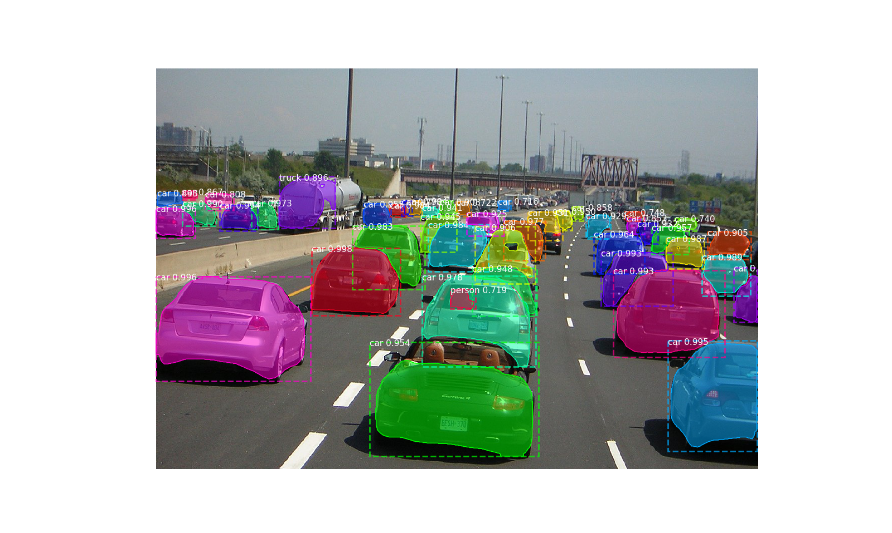

# Mask-RCNN by Pytorch

This is a Pytorch implementation of Mask R-CNN that based on [Matterport's](https://github.com/matterport/Mask_RCNN)
and [multimodallearning's](https://github.com/multimodallearning/pytorch-mask-rcnn) repository.

## Demo

## TODO
- [x] Single GPU training
- [ ] Build more backbone models
- [ ] Demo on video input
- [ ] Multi-GPU support

## Requirements
* Python 3
* Pytorch 0.4
* matplotlib, scipy, skimage, h5py

## Installation
1. Clone this repository.

        git clone git@github.com:psu1/Mask-RCNN.git

    
2. Build [NMS(Non-Maximum Suppression)](https://github.com/ruotianluo/pytorch-faster-rcnn)
and [RoiAlign](https://github.com/longcw/RoIAlign.pytorch) modules with the corresponding `--arch` option for cuda support.

    | GPU | arch |
    | --- | --- |
    | TitanX | sm_52 |
    | GTX 960M | sm_50 |
    | GTX 1070 | sm_61 |
    | GTX 1080 (Ti) | sm_61 |

        # first choose right --arch in make.sh
        cd Mask-RCNN/lib
        bash make.sh
        cd ../

3. Download [COCO dataset](http://cocodataset.org/#home). Or set `DOWNLOAD: True` in coco_train.yaml` and run

        python main.py train --cfg cfgs/coco_train.yaml

   It will automatically download the COCO dataset in `/path/to/coco/` for you.

4. Install the [Python COCO API](https://github.com/cocodataset/cocoapi) and create a symlink.

        cd data
        git clone https://github.com/pdollar/coco.git
        cd coco/PythonAPI
        make
        cd ../../..

    Create a symlink in `/lib/pycocotools`.

        ln -s /path/to/coco/cocoapi/PythonAPI/pycocotools/  /lib/pycocotools
    
4. Download the pretrained models on COCO and ImageNet from [Google Drive](https://drive.google.com/open?id=1LXUgC2IZUYNEoXr05tdqyKFZY0pZyPDc).

    Chnage the corresponding model path (COCO_MODEL_PATH) in `cfgs/coco_train_sample.yaml`.

## Demo

To test your installation simply run the demo with

    python demo.py
    python demo_video.py --video_file_path

## Training

The TRAIN_SCHEDULE, LEARNING_RATE and other parameters can be set in `CocoConfig` of `/models/train_val.py`.

For example, training on COCO dataset:

    # Train a new model starting from pre-trained COCO weights
    python main.py train --cfg cfgs/coco_train.yaml

You can also run the COCO evaluation code with:

    # Run COCO evaluation on the last trained model
    python main.py evaluate --cfg=cfgs/coco_train.yaml --last=True

## Results

COCO results for bounding box and segmentation are reported based on training
with the default configuration and backbone initialized with pretrained
ImageNet weights. Used metric is AP on IoU=0.50:0.95.

|    | from scratch | Mask R-CNN(Multi-GPU) | Mask R-CNN | Mask R-CNN paper |
| --- | --- | --- | --- | --- |
| bbox | TODO | TODO | 0.347 | 0.382 |
| segm | TODO | TODO | 0.296 | 0.354 |

