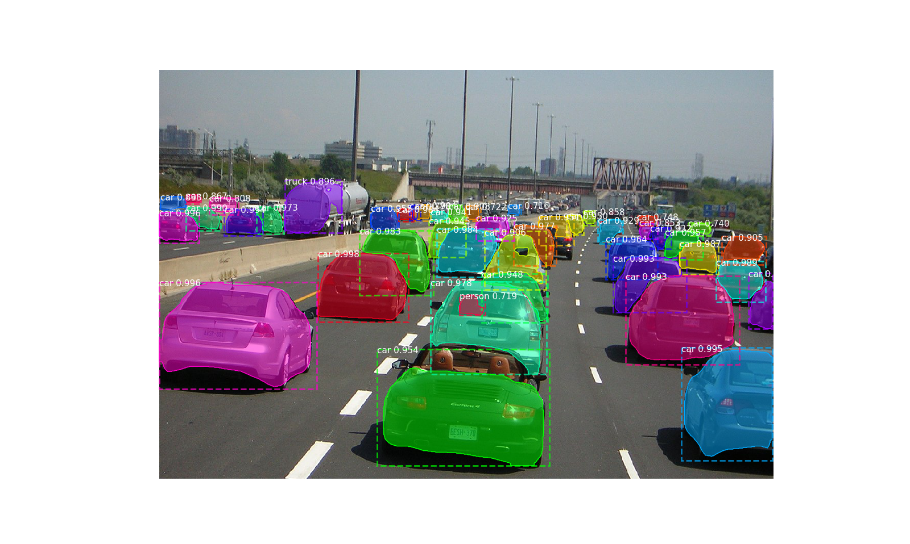

# Mask-RCNN by Pytorch

This is a Pytorch implementation of Mask R-CNN that based on [Matterport's](https://github.com/matterport/Mask_RCNN)
and [multimodallearning's](https://github.com/multimodallearning/pytorch-mask-rcnn) repository.

## Demo

## TODO
- [x] Single GPU training
- [ ] Build more backbone models
- [ ] Demo on video input
- [ ] Multi-GPU support

## Requirements
* Python 3
* Pytorch 0.4
* matplotlib, scipy, skimage, h5py

## Installation
1. Clone this repository.

        git clone git@github.com:psu1/Mask-RCNN.git

    
2. We use functions from two more repositories that need to be build with the right `--arch` option for cuda support.
The two functions are Non-Maximum Suppression from ruotianluo's [pytorch-faster-rcnn](https://github.com/ruotianluo/pytorch-faster-rcnn)
repository and longcw's [RoiAlign](https://github.com/longcw/RoIAlign.pytorch).

    | GPU | arch |
    | --- | --- |
    | TitanX | sm_52 |
    | GTX 960M | sm_50 |
    | GTX 1070 | sm_61 |
    | GTX 1080 (Ti) | sm_61 |

        cd nms/src/cuda/
        nvcc -c -o nms_kernel.cu.o nms_kernel.cu -x cu -Xcompiler -fPIC -arch=[arch]
        cd ../../
        python build.py
        cd ../

        cd roialign/roi_align/src/cuda/
        nvcc -c -o crop_and_resize_kernel.cu.o crop_and_resize_kernel.cu -x cu -Xcompiler -fPIC -arch=[arch]
        cd ../../
        python build.py
        cd ../../

3. As we use the [COCO dataset](http://cocodataset.org/#home) install the [Python COCO API](https://github.com/cocodataset/cocoapi) and
create a symlink.

        ln -s /path/to/coco/cocoapi/PythonAPI/pycocotools/  /lib/pycocotools
    
4. Download the pretrained models on COCO and ImageNet from [Google Drive](https://drive.google.com/open?id=1LXUgC2IZUYNEoXr05tdqyKFZY0pZyPDc).

## Demo

To test your installation simply run the demo with

    python demo.py
    python demo_video.py --video_file_path

## Training on COCO
Training and evaluation code is in main.py. You can run it from the command
line as such:

    # Train a new model starting from pre-trained COCO weights
    python main.py train --dataset=/path/to/coco/ --model=coco

    # Train a new model starting from ImageNet weights
    python main.py train --dataset=/path/to/coco/ --model=imagenet

    # Continue training a model that you had trained earlier
    python main.py train --dataset=/path/to/coco/ --model=/path/to/weights.h5

    # Continue training the last model you trained. This will find
    # the last trained weights in the model directory.
    python main.py train --dataset=/path/to/coco/ --model=last

If you have not yet downloaded the COCO dataset you should run the command
with the download option set, e.g.:

    # Train a new model starting from pre-trained COCO weights
    python main.py train --dataset=/path/to/coco/ --model=coco --download=true

You can also run the COCO evaluation code with:

    # Run COCO evaluation on the last trained model
    python main.py evaluate --dataset=/path/to/coco/ --model=last

The training schedule, learning rate, and other parameters can be set in main.py.

## Results

COCO results for bounding box and segmentation are reported based on training
with the default configuration and backbone initialized with pretrained
ImageNet weights. Used metric is AP on IoU=0.50:0.95.

|    | from scratch | converted from keras | Matterport's Mask_RCNN | Mask R-CNN paper |
| --- | --- | --- | --- | --- |
| bbox | TODO | 0.347 | 0.347 | 0.382 |
| segm | TODO | 0.296 | 0.296 | 0.354 |

